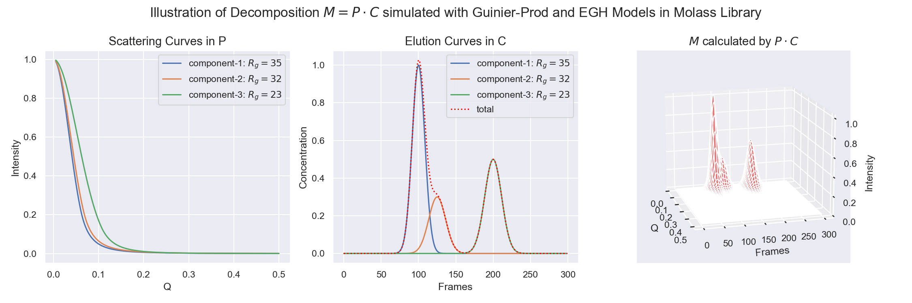

# Summary

Molass Library is a modern, open-source Python package designed for the analysis of SEC-SAXS (Small-Angle X-ray Scattering coupled with Size Exclusion Chromatography) experimental data. It represents a comprehensive rewrite of the original MOLASS tool [@Yonezawa:2023], currently hosted at the Japanese synchrotron radiation facilities, [Photon Factory](https://pfwww.kek.jp/saxs/MOLASS.html) and [SPring-8](https://www.riken.jp/en/research/labs/rsc/rd_ts_sra/life_sci_res_infrastruct/index.html). By leveraging the Python ecosystem and supporting interactive scripting in Jupyter notebooks, Molass Library provides enhanced flexibility, reproducibility, and extensibility compared to its predecessor.

A typical SEC-SAXS experiment involves two interconnected processes:

* **SEC** – Size Exclusion Chromatography
* **SAXS** – Small-Angle X-ray Scattering

Effective analysis requires seamless integration of both domains, which Molass Library facilitates through a unified, scriptable workflow.

# Statement of Need

Analysis of SEC-SAXS data is inherently multi-step and complex. A typical workflow includes:

1. Circular (Azimuthal) averaging
2. Background subtraction
3. Trimming of data
4. Baseline correction
5. Low rank factorization
6. Radius of gyration (*R*~g~) estimation – Guinier plot [@Guinier_1939]
7. Folding state estimation – Kratky plot [@Kratky_1963]
8. Electron density calculation 

Molass Library currently implements steps 3–7. For steps 1 and 2, users may employ SAngler [@Shimizu:2016] or device-specific software, while for step 8, DENSS [@Grant:2018] is recommended.

# State of the field

Several software tools address SEC-SAXS data processing. The proprietary ATSAS suite [@Manalastas-Cantos:ge5081] and the open-source BioXTAS RAW [@Hopkins:jl5075] provide comprehensive GUI-based workflows widely used in the field. For the specific challenge of overlapping peak decomposition—required when chromatographic peaks overlap or significant interparticle interference occurs—CHROMIXS defers such analysis to "other methods" [@Panjkovich:2018], whereas EFAMIX defines quantitative conditions for reliable separation (signal-to-noise ratio ≥10³ for three-component separation; peak asymmetry parameter τ≤2; baseline width separation ≥2× for reliable decomposition) [@Konarev:2021]. REGALS employs a two-stage framework combining EFA with L1 regularization [@Meisburger:mf5050] and is therefore guided by assumptions underlying EFA in strongly overlapping cases. Molass Library takes a complementary approach: rather than extending these existing GUI-based tools, it provides a Python-first, Jupyter-centric platform in which overlapping peak decomposition is handled through explicit parametric elution curve modeling combined with global optimization, constrained by physicochemical consistency derived from SEC theory (size-dependent elution behavior) and SAXS analysis (radius of gyration consistency across elution fractions).

# Software Design

The MOLASS library is designed to support sustainable software development through an open framework that enables broad community participation and contribution. This design philosophy prioritizes explicit, readable code over graphical interfaces, making the analysis methodology transparent for both learning and AI-assisted maintenance. We are actively enhancing AI-readiness through systematic usability testing with AI agents and iterative improvements to API discoverability and inline documentation. The architecture emphasizes modularity and clear separation of concerns: elution curve models (EGH, SDM, EDM) are isolated as parametric functions; low-rank factorization uses standard linear algebra (Moore-Penrose pseudoinverse); and visualization is decoupled from computation. By integrating established packages (NumPy, SciPy, pybaselines, ruptures) rather than reimplementing core functionality, we reduce custom code volume and enhance long-term viability. This approach allows domain researchers to maintain and extend the code using AI-assisted development tools.

# Research Impact Statement

The MOLASS library has demonstrated scientific value through research conducted using its predecessor GUI tool [@Jiang:2023; @Furukawa:2025], as well as through its contribution to the development of SEC-SAXS data analysis systems at synchrotron facilities [@Yonezawa:2023]. MOLASS is regarded within the community as providing a rigorous peak decomposition framework for SEC-SAXS analysis [@Matsui:2024].

# Notable package dependencies

Molass Library is built on robust scientific Python libraries, including NumPy, SciPy, and Matplotlib. It further integrates:

* **pybaselines** [@pybaselines] for advanced baseline correction
* **ruptures** [@TRUONG2020107299] for change point detection
* **scipy.signal.find_peaks** for peak recognition

By adopting these well-maintained packages, Molass Library reduces custom code and enhances reliability. The transition from a GUI-based workflow (previously using Tkinter) to Jupyter-based scripting further streamlines reproducibility and collaboration.

# Theoretical Foundation

A central feature of Molass Library is its implementation of **low rank factorization** using elution curve models, enabling decomposition of overlapping chromatographic peaks, a common challenge in SEC-SAXS analysis. The decomposition is formulated as:

$$ M = P \cdot C \qquad (1) $$

Roughly speaking, in practice methods find P and C that minimize ||M - PC||² (plus regularization terms) rather than achieving exact equality.

where:

* $M$: measured data matrix
* $P$: matrix of component scattering curves
* $C$: matrix of component elution curves

The optimal solution in the least-squares sense is given by:

$$ P = M \cdot C^{+} \qquad (2) $$

where $C^{+}$ denotes the Moore-Penrose pseudoinverse [@Penrose_1955; @Penrose_1956]. This approach enables robust separation of components, even in the presence of overlapping peaks, provided suitable constraints are applied.
Moreover, when interparticle interference is significant, the second-order virial approximation of the structure factor yields $I(q,c) \approx cA(q) + c^{2}B(q)$, which maps naturally onto Eq. (1) by augmenting $C$ with an additional $c^{2}$ row vector per affected component.

# Elution Curve Modeling

To address underdeterminedness and enhance interpretability, Molass Library incorporates several established elution curve models:

* **EGH**: Exponential Gaussian Hybrid [@LAN20011]
* **SDM**: Stochastic Dispersive Model [@Felinger1999]
* **EDM**: Equilibrium Dispersive Model [@Ur2021]

These models allow users to impose domain-specific constraints, thereby enhancing both the accuracy and the physical relevance of the chromatographic peak decomposition.

# Availability and Documentation

Molass Library is freely available under an open-source license at [https://github.com/biosaxs-dev/molass-library](https://github.com/biosaxs-dev/molass-library). Comprehensive documentation, including tutorials and theoretical background, is provided at [Molass Essence](https://biosaxs-dev.github.io/molass-essence/chapters/intro.html).

# AI usage disclosure

Generative AI tools (GitHub Copilot with Claude Sonnet 4, Claude Opus 4, and earlier models including Claude 3.5 Sonnet and ChatGPT-4) were used for the following aspects of this submission:

* **Paper text**: AI assistance was used to improve English grammar, sentence structure, and clarity. All technical content, design decisions, and scientific claims were authored by the human authors.
* **Code generation**: AI contributed to implementing routine code (e.g., standard NumPy operations, Matplotlib boilerplate) as well as targeted bug fixes and API improvements identified through AI-driven usability testing. All core algorithms, elution curve models, and scientific logic were designed and directed by the human authors.
* **Model development**: AI collaboration was integral to the rapid development of LKM (Lumped Kinetic Model) and GRM (General Rate Model) support (2026). The library's scriptable architecture enabled iterative AI-assisted coding sessions that would have been impractical with GUI-only code. The human authors directed all model design decisions, numerical implementations, and validation procedures.
* **Documentation**: Significant portions of the tutorial notebooks and API documentation were initially drafted with AI assistance, then reviewed, corrected, and refined by the human authors.
* **AI-friendliness improvement cycle**: As described in the Software Design section, AI agents were used as systematic testers of the library's API. Usability issues discovered during AI-driven analysis sessions were logged as GitHub Issues and resolved iteratively, improving API discoverability and error reporting.

All AI-generated content was reviewed, validated, and edited by the human authors, who made all core design decisions and remain fully responsible for the accuracy and integrity of this submission. The development history, including all AI-assisted changes, is recorded in the repository's Git log and GitHub Issues.

# Acknowledgements

This work was supported by JSPS KAKENHI Grant Number JP25K07250, and partially by Research Support Project for Life Science and Drug Discovery (Basis for Supporting Innovative Drug Discovery and Life Science Research (BINDS)) from AMED under Grant Number JP25ama121001.

# References

::: {#refs}
:::
